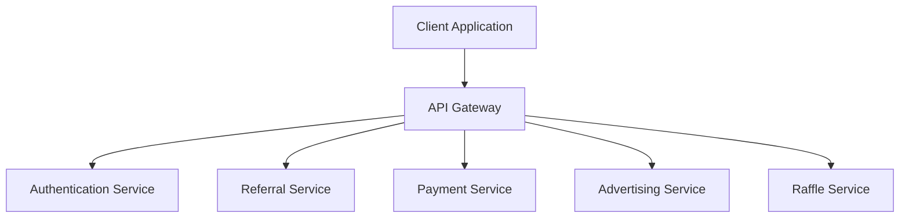

# The Brick Platform - System Breakdown

86f9af653b50718d331c248ced3f6f70

## 1. System Architecture

### 1.1 Technology Stack
- Frontend: React + TypeScript + Tailwind CSS
- Backend: Node.js with Express
- Database: PostgreSQL (via Supabase)
- Authentication: Supabase Auth
- Payment Integration: Mobile Money API
- Real-time Updates: Supabase Realtime

### 1.2 Core Components


## 2. Database Schema

### 2.1 Users Table
```sql
CREATE TABLE users (
  id UUID PRIMARY KEY DEFAULT gen_random_uuid(),
  email TEXT UNIQUE NOT NULL,
  full_name TEXT NOT NULL,
  phone_number TEXT NOT NULL,
  is_active BOOLEAN DEFAULT false,
  registration_paid BOOLEAN DEFAULT false,
  created_at TIMESTAMPTZ DEFAULT now(),
  deactivated_at TIMESTAMPTZ
);
```

### 2.2 Referral Links Table
```sql
CREATE TABLE referral_links (
  id UUID PRIMARY KEY DEFAULT gen_random_uuid(),
  user_id UUID REFERENCES users(id),
  code TEXT UNIQUE NOT NULL,
  uses_remaining INTEGER DEFAULT 3,
  is_active BOOLEAN DEFAULT true,
  created_at TIMESTAMPTZ DEFAULT now()
);
```

### 2.3 Referral Chain Table
```sql
CREATE TABLE referral_chain (
  id UUID PRIMARY KEY DEFAULT gen_random_uuid(),
  user_id UUID REFERENCES users(id),
  beneficiary_id UUID REFERENCES users(id),
  position INTEGER NOT NULL,
  created_at TIMESTAMPTZ DEFAULT now(),
  UNIQUE(user_id, position)
);
```

### 2.4 Payments Table
```sql
CREATE TABLE payments (
  id UUID PRIMARY KEY DEFAULT gen_random_uuid(),
  user_id UUID REFERENCES users(id),
  amount DECIMAL NOT NULL,
  type TEXT NOT NULL, -- 'registration' or 'referral_earning'
  status TEXT NOT NULL, -- 'pending', 'completed', 'failed'
  mobile_money_reference TEXT,
  created_at TIMESTAMPTZ DEFAULT now()
);
```

## 3. API Endpoints

### 3.1 Authentication
- POST `/auth/register`
  - Register new user with email, name, phone
- POST `/auth/verify-email`
  - Verify email with code
- POST `/auth/resend-verification`
  - Resend verification email

### 3.2 Referral System
- GET `/referrals/my-links`
  - Get user's referral links
- GET `/referrals/tree`
  - Get user's referral tree
- POST `/referrals/generate-link`
  - Generate new referral link
- GET `/referrals/earnings`
  - Get earnings history

### 3.3 Payments
- POST `/payments/initiate-registration`
  - Start registration payment process
- POST `/payments/verify-registration`
  - Verify registration payment
- GET `/payments/history`
  - Get payment history

## 4. Component Structure

### 4.1 Core Components
```
src/
├── components/
│   ├── auth/
│   │   ├── RegistrationForm.tsx
│   │   ├── VerificationForm.tsx
│   │   └── PaymentForm.tsx
│   ├── referrals/
│   │   ├── ReferralTree.tsx
│   │   ├── ReferralLinks.tsx
│   │   └── EarningsDisplay.tsx
│   └── shared/
│       ├── Layout.tsx
│       ├── Navigation.tsx
│       └── LoadingStates.tsx
```

### 4.2 Referral Tree Component
```typescript
interface TreeNode {
  id: string;
  name: string;
  isActive: boolean;
  earnings: number;
  children: TreeNode[];
}

interface ReferralTreeProps {
  data: TreeNode;
  onNodeClick: (nodeId: string) => void;
}
```

## 5. Business Logic Implementation

### 5.1 Referral Chain Management
1. When a new user registers via referral:
   - Check if referrer's chain has space (< 7 beneficiaries)
   - If full, remove oldest beneficiary
   - Add new user to chain
   - Update earnings distribution

### 5.2 Payment Distribution
1. On registration payment (90,000 UGX):
   - Company receives 20,000 UGX
   - Each beneficiary (7) receives 10,000 UGX
   - Trigger Mobile Money transfers
   - Update payment records

### 5.3 Account Lifecycle
1. Registration:
   - User registers → Unverified
   - Email verified → Awaiting Payment
   - Payment confirmed → Active
2. Deactivation:
   - Earnings completed → Account deactivated
   - Referral links disabled
   - Remove from active referral chains

## 6. Security Considerations

### 6.1 Data Protection
- Email verification required
- Phone number validation
- Secure payment processing
- Rate limiting on API endpoints

### 6.2 Fraud Prevention
- Verify unique phone numbers
- Monitor multiple registrations
- Track payment patterns
- Validate referral chain integrity

## 7. Monitoring and Analytics

### 7.1 Key Metrics
- User registration rate
- Payment success rate
- Referral chain completion rate
- Average earnings per user
- Platform revenue

### 7.2 System Health
- API response times
- Payment processing times
- Error rates
- User session analytics

## 8. Future Considerations

### 8.1 Scalability
- Implement caching for referral trees
- Optimize database queries
- Add load balancing
- Implement CDN for static content

### 8.2 Features
- Mobile app development
- Additional payment methods
- Enhanced analytics dashboard
- Automated fraud detection
- Improved referral visualization